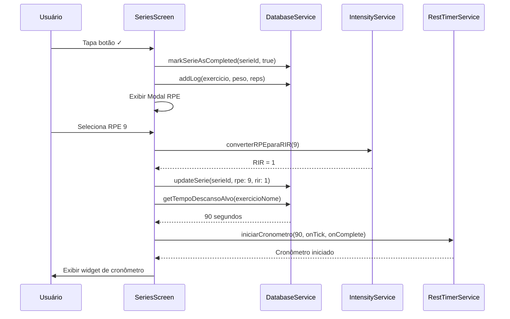
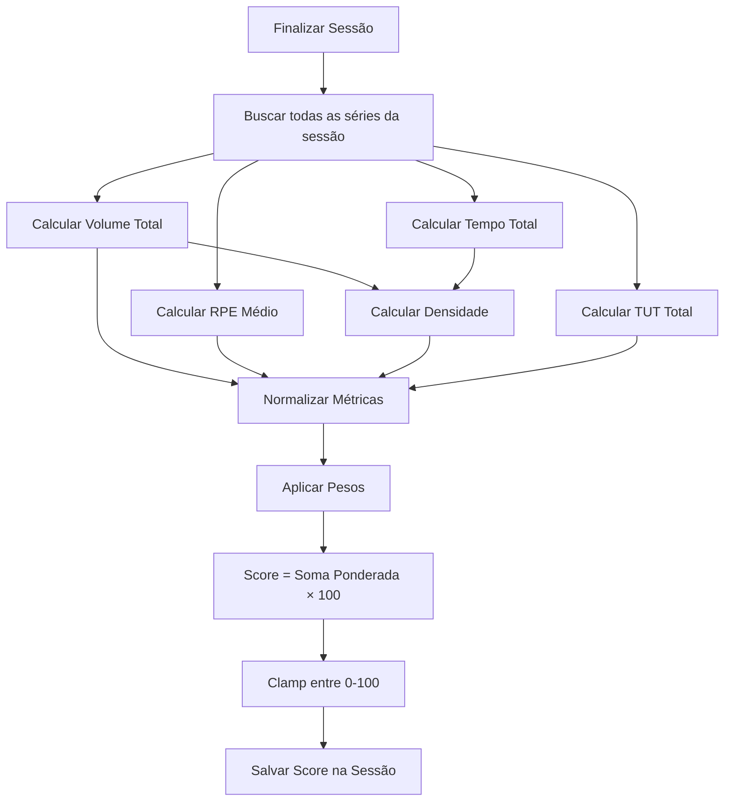

# Design: Controle de Intensidade Real

## Visão Geral

Este documento descreve o design técnico para adicionar métricas de intensidade ao aplicativo de rastreamento de treinos. O sistema atual rastreia apenas volume (peso × repetições × séries), mas não captura a intensidade percebida ou temporal do treino. Esta funcionalidade adiciona:

- **RPE (Rate of Perceived Exertion)**: Escala subjetiva de esforço (1-10)
- **RIR (Reps in Reserve)**: Repetições deixadas na reserva (0-5+)
- **Cronômetro de Descanso**: Tempo real entre séries com notificações
- **TUT (Time Under Tension)**: Tempo sob tensão durante a execução
- **Densidade de Treino**: Relação volume/tempo para medir eficiência
- **Dashboard de Análise**: Visualização combinada de todas as métricas

O design prioriza entrada rápida de dados durante o treino, mantendo todos os campos opcionais para não interromper o fluxo do usuário.

## Arquitetura

### Visão Geral da Arquitetura

```
┌─────────────────────────────────────────────────────────────┐
│                        UI Layer                              │
│  ┌──────────────┐  ┌──────────────┐  ┌──────────────┐      │
│  │ SeriesScreen │  │RestTimerWidget│ │IntensityDash │      │
│  │  + RPE/RIR   │  │  (Floating)   │ │   board      │      │
│  └──────┬───────┘  └──────┬────────┘  └──────┬───────┘      │
└─────────┼──────────────────┼──────────────────┼──────────────┘
          │                  │                  │
┌─────────┼──────────────────┼──────────────────┼──────────────┐
│         │         Service Layer               │              │
│  ┌──────▼──────────┐  ┌──────▼────────┐  ┌──▼──────────┐   │
│  │IntensityService │  │ RestTimer     │  │AnalysisServ │   │
│  │ - RPE↔RIR conv  │  │ Service       │  │ ice         │   │
│  │ - Calculations  │  │ - Timer mgmt  │  │ - Metrics   │   │
│  │ - Validations   │  │ - Notifs      │  │ - Trends    │   │
│  └──────┬──────────┘  └──────┬────────┘  └──┬──────────┘   │
└─────────┼──────────────────────┼──────────────┼──────────────┘
          │                      │              │
┌─────────┼──────────────────────┼──────────────┼──────────────┐
│         │         Data Layer                  │              │
│  ┌──────▼──────────────────────▼──────────────▼──────────┐  │
│  │              DatabaseService                           │  │
│  │  - series (extended with intensity fields)             │  │
│  │  - configuracoes_exercicio (new)                       │  │
│  │  - sessao_treino (new)                                 │  │
│  └────────────────────────────────────────────────────────┘  │
└─────────────────────────────────────────────────────────────┘
```

### Princípios de Design

1. **Entrada Opcional**: Todas as métricas de intensidade são opcionais para não interromper o fluxo
2. **Valores Inteligentes**: Sugestões automáticas baseadas em contexto (ex: TUT baseado em reps)
3. **Conversão Automática**: RPE ↔ RIR conversão bidirecional transparente
4. **Feedback Imediato**: Cálculos e visualizações em tempo real
5. **Configurabilidade**: Usuário controla quais métricas quer usar

## Componentes e Interfaces

### 1. IntensityService

Serviço central para cálculos e conversões de intensidade.

```dart
class IntensityService {
  /// Converte RPE (1-10) para RIR (0-5+)
  /// RPE 10 = RIR 0 (falha)
  /// RPE 9 = RIR 1
  /// RPE 8 = RIR 2
  /// RPE 7 = RIR 3
  /// RPE 6 = RIR 4
  /// RPE ≤5 = RIR 5+
  static int converterRPEparaRIR(int rpe);
  
  /// Converte RIR (0-5+) para RPE (1-10)
  /// Inverso da função acima
  static int converterRIRparaRPE(int rir);
  
  /// Calcula densidade: Volume Total (kg) / Tempo Total (min)
  /// @param volumeTotal: soma de (peso × reps) de todas as séries
  /// @param tempoTotalSegundos: tempo total da sessão em segundos
  /// @return densidade em kg/min
  static double calcularDensidade(double volumeTotal, int tempoTotalSegundos);
  
  /// Calcula TUT sugerido baseado em repetições
  /// Usa tempo padrão de 4 segundos por repetição (2s concêntrica + 2s excêntrica)
  /// @param repeticoes: número de repetições da série
  /// @return TUT sugerido em segundos
  static int calcularTUTSugerido(int repeticoes);
  
  /// Calcula score de intensidade (0-100) baseado em múltiplas métricas
  /// Combina: volume, RPE médio, densidade, TUT total
  /// @return score normalizado 0-100
  static int calcularScoreIntensidade({
    required double volumeTotal,
    required double rpeMedio,
    required double densidade,
    required int tutTotal,
  });
  
  /// Sugere RPE ideal baseado em objetivo de treino
  /// Hipertrofia: 7-9 (RIR 1-3)
  /// Força: 8-10 (RIR 0-2)
  /// Resistência: 5-7 (RIR 3-5)
  static int sugerirRPEIdeal(String objetivo);
  
  /// Valida se RPE está na faixa válida (1-10)
  static bool validarRPE(int rpe);
  
  /// Valida se RIR está na faixa válida (0-5+)
  static bool validarRIR(int rir);
  
  /// Detecta risco de overtraining baseado em RPE consistentemente alto
  /// @param rpeMedioUltimos7Dias: RPE médio dos últimos 7 dias
  /// @return true se RPE médio > 9
  static bool detectarRiscoOvertraining(double rpeMedioUltimos7Dias);
}
```

### 2. RestTimerService

Gerencia cronômetros de descanso entre séries.

```dart
class RestTimerService {
  /// Inicia cronômetro de descanso
  /// @param tempoAlvoSegundos: tempo alvo configurado para o exercício
  /// @param onTick: callback chamado a cada segundo com tempo decorrido
  /// @param onComplete: callback chamado quando tempo alvo é atingido
  static void iniciarCronometro({
    required int tempoAlvoSegundos,
    required Function(int segundosDecorridos) onTick,
    required Function() onComplete,
  });
  
  /// Para o cronômetro atual
  static void pararCronometro();
  
  /// Pausa o cronômetro (pode ser retomado)
  static void pausarCronometro();
  
  /// Retoma cronômetro pausado
  static void retomarCronometro();
  
  /// Retorna tempo decorrido atual em segundos
  static int getTempoDecorrido();
  
  /// Verifica se há um cronômetro ativo
  static bool isAtivo();
  
  /// Emite notificação quando tempo alvo é atingido
  /// Usa vibração + som (se habilitado nas configurações)
  static Future<void> notificarTempoAlvo();
}
```

### 3. TUTService

Gerencia rastreamento de tempo sob tensão.

```dart
class TUTService {
  /// Inicia rastreamento de TUT para uma série
  static void iniciarTUT();
  
  /// Para rastreamento e retorna TUT em segundos
  static int pararTUT();
  
  /// Retorna TUT atual em segundos (durante execução)
  static int getTUTAtual();
  
  /// Verifica se TUT está sendo rastreado
  static bool isRastreando();
}
```

### 4. AnalysisService

Realiza análises e cálculos agregados de intensidade.

```dart
class AnalysisService {
  /// Analisa intensidade completa de uma sessão de treino
  /// @param sessaoId: ID da sessão na tabela sessao_treino
  /// @return mapa com todas as métricas calculadas
  static Future<Map<String, dynamic>> analisarIntensidadeSessao(int sessaoId);
  
  /// Calcula RPE médio de um exercício na sessão atual
  static Future<double> calcularRPEMedioExercicio(int exercicioId);
  
  /// Calcula RIR médio de um exercício na sessão atual
  static Future<double> calcularRIRMedioExercicio(int exercicioId);
  
  /// Calcula tempo médio de descanso de um exercício
  static Future<double> calcularDescansoMedioExercicio(int exercicioId);
  
  /// Calcula TUT total de um exercício
  static Future<int> calcularTUTTotalExercicio(int exercicioId);
  
  /// Compara densidade entre sessões
  /// @return lista de densidades das últimas N sessões
  static Future<List<double>> compararDensidadeSessoes(int numSessoes);
  
  /// Gera recomendações baseadas em métricas de intensidade
  /// @return lista de strings com recomendações
  static Future<List<String>> gerarRecomendacoes(int sessaoId);
}
```

### 5. ConfigService

Gerencia configurações de usuário para intensidade.

```dart
class ConfigService {
  /// Salva configuração de tempo de descanso alvo para um exercício
  static Future<void> salvarTempoDescansoAlvo(String exercicioNome, int segundos);
  
  /// Busca tempo de descanso alvo configurado
  /// @return tempo em segundos, ou null se não configurado
  static Future<int?> getTempoDescansoAlvo(String exercicioNome);
  
  /// Salva TUT alvo para um exercício
  static Future<void> salvarTUTAlvo(String exercicioNome, int segundos);
  
  /// Busca TUT alvo configurado
  static Future<int?> getTUTAlvo(String exercicioNome);
  
  /// Salva RPE alvo para um exercício
  static Future<void> salvarRPEAlvo(String exercicioNome, int rpe);
  
  /// Busca RPE alvo configurado
  static Future<int?> getRPEAlvo(String exercicioNome);
  
  /// Configurações globais (usando SharedPreferences)
  static Future<void> setUsarRPE(bool usar);
  static Future<bool> getUsarRPE();
  
  static Future<void> setUsarRIR(bool usar);
  static Future<bool> getUsarRIR();
  
  static Future<void> setCronometroAutomatico(bool automatico);
  static Future<bool> getCronometroAutomatico();
  
  static Future<void> setNotificacaoDescanso(bool ativar);
  static Future<bool> getNotificacaoDescanso();
  
  static Future<void> setTempoDescansoDefault(int segundos);
  static Future<int> getTempoDescansoDefault();
}
```

## Modelos de Dados

### Extensão da Tabela `series`

Campos adicionados à tabela existente:

```sql
ALTER TABLE series ADD COLUMN rpe INTEGER;              -- 1-10, nullable
ALTER TABLE series ADD COLUMN rir INTEGER;              -- 0-5+, nullable
ALTER TABLE series ADD COLUMN tempo_descanso_segundos INTEGER;  -- nullable
ALTER TABLE series ADD COLUMN tut_segundos INTEGER;     -- nullable
ALTER TABLE series ADD COLUMN tempo_inicio TIMESTAMP;   -- nullable
ALTER TABLE series ADD COLUMN tempo_fim TIMESTAMP;      -- nullable
```

**Modelo Dart**:
```dart
class Serie {
  final int id;
  final int exercicioId;
  final double? peso;
  final int? repeticoes;
  final bool isCompleted;
  
  // Novos campos de intensidade
  final int? rpe;                    // 1-10
  final int? rir;                    // 0-5+
  final int? tempoDescansoSegundos;  // tempo real de descanso
  final int? tutSegundos;            // tempo sob tensão
  final DateTime? tempoInicio;       // timestamp início da série
  final DateTime? tempoFim;          // timestamp fim da série
  
  Serie({
    required this.id,
    required this.exercicioId,
    this.peso,
    this.repeticoes,
    required this.isCompleted,
    this.rpe,
    this.rir,
    this.tempoDescansoSegundos,
    this.tutSegundos,
    this.tempoInicio,
    this.tempoFim,
  });
  
  factory Serie.fromMap(Map<String, dynamic> map) {
    return Serie(
      id: map['id'] as int,
      exercicioId: map['exercicio_id'] as int,
      peso: map['peso'] as double?,
      repeticoes: map['repeticoes'] as int?,
      isCompleted: map['is_completed'] == 1,
      rpe: map['rpe'] as int?,
      rir: map['rir'] as int?,
      tempoDescansoSegundos: map['tempo_descanso_segundos'] as int?,
      tutSegundos: map['tut_segundos'] as int?,
      tempoInicio: map['tempo_inicio'] != null 
        ? DateTime.parse(map['tempo_inicio'] as String) 
        : null,
      tempoFim: map['tempo_fim'] != null 
        ? DateTime.parse(map['tempo_fim'] as String) 
        : null,
    );
  }
}
```

### Nova Tabela `configuracoes_exercicio`

Armazena configurações específicas por exercício.

```sql
CREATE TABLE configuracoes_exercicio (
  id INTEGER PRIMARY KEY AUTOINCREMENT,
  exercicio_nome TEXT NOT NULL UNIQUE,
  tempo_descanso_alvo INTEGER,  -- segundos
  tut_alvo INTEGER,              -- segundos
  rpe_alvo INTEGER,              -- 1-10
  CONSTRAINT fk_exercicio_nome FOREIGN KEY (exercicio_nome) 
    REFERENCES exercicios(nome) ON DELETE CASCADE
);
```

**Modelo Dart**:
```dart
class ConfiguracaoExercicio {
  final int id;
  final String exercicioNome;
  final int? tempoDescansoAlvo;  // segundos
  final int? tutAlvo;            // segundos
  final int? rpeAlvo;            // 1-10
  
  ConfiguracaoExercicio({
    required this.id,
    required this.exercicioNome,
    this.tempoDescansoAlvo,
    this.tutAlvo,
    this.rpeAlvo,
  });
  
  factory ConfiguracaoExercicio.fromMap(Map<String, dynamic> map) {
    return ConfiguracaoExercicio(
      id: map['id'] as int,
      exercicioNome: map['exercicio_nome'] as String,
      tempoDescansoAlvo: map['tempo_descanso_alvo'] as int?,
      tutAlvo: map['tut_alvo'] as int?,
      rpeAlvo: map['rpe_alvo'] as int?,
    );
  }
}
```

### Nova Tabela `sessao_treino`

Armazena dados agregados de cada sessão de treino.

```sql
CREATE TABLE sessao_treino (
  id INTEGER PRIMARY KEY AUTOINCREMENT,
  dia_id INTEGER NOT NULL,
  data_inicio TIMESTAMP NOT NULL,
  data_fim TIMESTAMP,
  densidade REAL,              -- kg/min
  score_intensidade INTEGER,   -- 0-100
  volume_total REAL,           -- kg
  rpe_medio REAL,              -- 1-10
  tut_total INTEGER,           -- segundos
  tempo_descanso_medio INTEGER, -- segundos
  FOREIGN KEY (dia_id) REFERENCES dias(id) ON DELETE CASCADE
);
```

**Modelo Dart**:
```dart
class SessaoTreino {
  final int id;
  final int diaId;
  final DateTime dataInicio;
  final DateTime? dataFim;
  final double? densidade;           // kg/min
  final int? scoreIntensidade;       // 0-100
  final double? volumeTotal;         // kg
  final double? rpeMedio;            // 1-10
  final int? tutTotal;               // segundos
  final int? tempoDescansoMedio;     // segundos
  
  SessaoTreino({
    required this.id,
    required this.diaId,
    required this.dataInicio,
    this.dataFim,
    this.densidade,
    this.scoreIntensidade,
    this.volumeTotal,
    this.rpeMedio,
    this.tutTotal,
    this.tempoDescansoMedio,
  });
  
  factory SessaoTreino.fromMap(Map<String, dynamic> map) {
    return SessaoTreino(
      id: map['id'] as int,
      diaId: map['dia_id'] as int,
      dataInicio: DateTime.parse(map['data_inicio'] as String),
      dataFim: map['data_fim'] != null 
        ? DateTime.parse(map['data_fim'] as String) 
        : null,
      densidade: map['densidade'] as double?,
      scoreIntensidade: map['score_intensidade'] as int?,
      volumeTotal: map['volume_total'] as double?,
      rpeMedio: map['rpe_medio'] as double?,
      tutTotal: map['tut_total'] as int?,
      tempoDescansoMedio: map['tempo_descanso_medio'] as int?,
    );
  }
}
```

## Fluxo de Dados

### Fluxo de Conclusão de Série (Atualizado)

```
Usuário completa série
    ↓
1. Atualiza peso/reps (existente)
    ↓
2. [NOVO] Modal rápido de RPE/RIR (opcional, pode pular)
    ↓
3. [NOVO] Salva RPE/RIR se fornecido
    ↓
4. [NOVO] Calcula tempo de descanso desde última série
    ↓
5. [NOVO] Salva tempo_descanso_segundos
    ↓
6. Marca série como completa (existente)
    ↓
7. Salva log (existente)
    ↓
8. [NOVO] Inicia cronômetro de descanso automaticamente
    ↓
9. Verifica status do dia (existente)
```

### Fluxo de Sessão de Treino

```
Usuário inicia treino do dia
    ↓
1. [NOVO] Cria registro em sessao_treino
   - dia_id
   - data_inicio = now()
    ↓
2. Usuário completa séries (fluxo acima)
    ↓
3. Usuário finaliza treino
    ↓
4. [NOVO] Calcula métricas agregadas:
   - volume_total
   - rpe_medio
   - densidade
   - tut_total
   - tempo_descanso_medio
   - score_intensidade
    ↓
5. [NOVO] Atualiza sessao_treino:
   - data_fim = now()
   - todas as métricas calculadas
    ↓
6. [NOVO] Exibe resumo da sessão
```

## Interface do Usuário

### 1. Extensão da SeriesScreen

Adiciona campos de intensidade à tela de séries existente.

**Modificações**:
- Adicionar botão de RPE/RIR após marcar série como completa
- Exibir RPE/RIR médio do exercício no topo (junto com PR e Volume)
- Mostrar cronômetro flutuante durante descanso
- Adicionar botão de TUT (iniciar/parar) durante execução da série

**Layout Proposto**:
```
┌─────────────────────────────────────┐
│  [PR: 100kg]    [Peito]             │
│  [Volume: 1200kg] [RPE Médio: 8.5]  │
├─────────────────────────────────────┤
│  SÉRIE    KG      REPS    [✓]       │
├─────────────────────────────────────┤
│   1      80      10      [✓] RPE:9  │
│   2      80      10      [ ]        │
│   3      80      10      [ ]        │
├─────────────────────────────────────┤
│  [+ Adicionar série]                │
└─────────────────────────────────────┘
│  [Cronômetro: 1:30 / 2:00] 🔔       │ ← Flutuante
└─────────────────────────────────────┘
```

### 2. Modal de RPE/RIR

Modal rápido que aparece após marcar série como completa.

**Características**:
- Pode ser pulado (botão "Pular" ou tap fora)
- Botões grandes para seleção rápida
- Mostra conversão automática (se selecionar RPE, mostra RIR equivalente)
- Salva e fecha automaticamente ao selecionar

**Layout**:
```
┌─────────────────────────────────────┐
│  Como foi a série?                  │
├─────────────────────────────────────┤
│  RPE:  [6] [7] [8] [9] [10]         │
│        ↕ conversão automática       │
│  RIR:  [4] [3] [2] [1] [0]          │
├─────────────────────────────────────┤
│  [Pular]                  [Salvar]  │
└─────────────────────────────────────┘
```

### 3. Widget de Cronômetro Flutuante

Aparece automaticamente após completar série (se habilitado).

**Características**:
- Posição fixa no bottom da tela
- Mostra tempo decorrido / tempo alvo
- Botão de pausa/retomar
- Notificação quando tempo alvo é atingido
- Pode ser fechado manualmente

### 4. Dashboard de Intensidade

Nova tela ou seção na tela de estatísticas.

**Métricas Exibidas**:
- Score de Intensidade (0-100) com gauge visual
- Volume Total da sessão
- RPE Médio
- Densidade (kg/min)
- TUT Total
- Tempo de Descanso Médio
- Comparação com sessões anteriores

**Gráficos**:
- Evolução de RPE ao longo do tempo
- Evolução de Densidade ao longo do tempo
- Comparação Volume vs RPE
- Tempo de Descanso Real vs Alvo


## Propriedades de Correção

*Uma propriedade é uma característica ou comportamento que deve ser verdadeiro em todas as execuções válidas de um sistema - essencialmente, uma declaração formal sobre o que o sistema deve fazer. As propriedades servem como ponte entre especificações legíveis por humanos e garantias de correção verificáveis por máquina.*

### Análise de Testabilidade

Após análise dos critérios de aceitação, identificamos as seguintes propriedades testáveis. Propriedades redundantes foram consolidadas para evitar duplicação de testes.

**Propriedade 1: Validação de RPE**
*Para qualquer* valor de RPE fornecido, o sistema deve aceitar valores entre 1-10 (inclusive) e rejeitar valores fora dessa faixa
**Valida: Requisitos US-1.1**

**Propriedade 2: Cálculo de RPE Médio**
*Para qualquer* conjunto de séries com valores de RPE, o RPE médio calculado deve ser igual à soma dos RPEs dividida pelo número de séries com RPE registrado
**Valida: Requisitos US-1.3**

**Propriedade 3: Detecção de Overtraining**
*Para qualquer* sequência de sessões de treino, se o RPE médio dos últimos 7 dias for maior que 9, o sistema deve emitir um alerta de risco de overtraining
**Valida: Requisitos US-1.6**

**Propriedade 4: Validação de RIR**
*Para qualquer* valor de RIR fornecido, o sistema deve aceitar valores entre 0-5 (inclusive) e valores maiores que 5 marcados como "5+", rejeitando valores negativos
**Valida: Requisitos US-2.1**

**Propriedade 5: Conversão RPE↔RIR Round-Trip**
*Para qualquer* valor de RPE entre 6-10, converter para RIR e depois converter de volta para RPE deve retornar o valor original
**Valida: Requisitos US-2.2**

**Propriedade 6: Cálculo de RIR Médio**
*Para qualquer* conjunto de séries com valores de RIR, o RIR médio calculado deve ser igual à soma dos RIRs dividida pelo número de séries com RIR registrado
**Valida: Requisitos US-2.3**

**Propriedade 7: Cronômetro Automático**
*Para qualquer* série completada, se o cronômetro automático estiver habilitado, o sistema deve iniciar um cronômetro de descanso imediatamente após a conclusão
**Valida: Requisitos US-3.1**

**Propriedade 8: Validação de Tempo de Descanso Alvo**
*Para qualquer* configuração de tempo de descanso alvo, o sistema deve aceitar valores entre 30 segundos e 300 segundos (5 minutos), rejeitando valores fora dessa faixa
**Valida: Requisitos US-3.3**

**Propriedade 9: Persistência de Tempo de Descanso**
*Para qualquer* série com tempo de descanso registrado, salvar e depois recuperar o tempo de descanso deve retornar o mesmo valor
**Valida: Requisitos US-3.4, US-1.4, US-2.5, US-4.6**

**Propriedade 10: Cálculo de Descanso Médio**
*Para qualquer* conjunto de séries com tempos de descanso, o tempo médio calculado deve ser igual à soma dos tempos dividida pelo número de séries com tempo registrado
**Valida: Requisitos US-3.5**

**Propriedade 11: Validação de TUT**
*Para qualquer* valor de TUT fornecido, o sistema deve aceitar valores positivos (> 0) e rejeitar valores zero ou negativos
**Valida: Requisitos US-4.1**

**Propriedade 12: Cálculo de TUT Sugerido**
*Para qualquer* número de repetições, o TUT sugerido deve ser igual a repetições × 4 segundos
**Valida: Requisitos US-4.2**

**Propriedade 13: Cálculo de TUT Médio**
*Para qualquer* conjunto de séries com valores de TUT, o TUT médio calculado deve ser igual à soma dos TUTs dividida pelo número de séries com TUT registrado
**Valida: Requisitos US-4.3**

**Propriedade 14: Cálculo de TUT Total**
*Para qualquer* conjunto de séries com valores de TUT, o TUT total deve ser igual à soma de todos os valores de TUT
**Valida: Requisitos US-4.4**

**Propriedade 15: Alerta de TUT Baixo**
*Para qualquer* série com TUT registrado, se TUT real for menor que 70% do TUT sugerido (baseado em reps), o sistema deve emitir um alerta
**Valida: Requisitos US-4.5**

**Propriedade 16: Cálculo de Densidade**
*Para qualquer* volume total (kg) e tempo total (segundos), a densidade calculada deve ser igual a (volume / tempo) × 60 para obter kg/min
**Valida: Requisitos US-5.1**

**Propriedade 17: Recuperação de Sessões Históricas**
*Para qualquer* conjunto de sessões salvas, recuperar sessões por período deve retornar todas as sessões dentro daquele período ordenadas por data
**Valida: Requisitos US-5.3, US-6.3**

**Propriedade 18: Score de Intensidade Limitado**
*Para qualquer* conjunto de métricas de intensidade, o score calculado deve sempre estar entre 0 e 100 (inclusive)
**Valida: Requisitos US-6.2**

**Propriedade 19: Score de Intensidade Monotônico**
*Para qualquer* duas sessões A e B, se A tem volume maior, RPE maior, densidade maior e TUT maior que B, então o score de A deve ser maior ou igual ao score de B
**Valida: Requisitos US-6.2**


## Tratamento de Erros

### Validação de Entrada

**RPE Inválido**:
- Entrada: RPE < 1 ou RPE > 10
- Resposta: Rejeitar entrada, manter valor anterior, mostrar mensagem "RPE deve estar entre 1 e 10"

**RIR Inválido**:
- Entrada: RIR < 0
- Resposta: Rejeitar entrada, manter valor anterior, mostrar mensagem "RIR não pode ser negativo"

**Tempo de Descanso Inválido**:
- Entrada: Tempo < 30s ou Tempo > 300s
- Resposta: Rejeitar configuração, usar valor padrão (90s), mostrar mensagem "Tempo deve estar entre 30s e 5min"

**TUT Inválido**:
- Entrada: TUT ≤ 0
- Resposta: Rejeitar entrada, não salvar valor, mostrar mensagem "TUT deve ser maior que zero"

### Erros de Cálculo

**Divisão por Zero na Densidade**:
- Situação: Tempo total = 0
- Resposta: Retornar densidade = 0, não calcular

**Média sem Dados**:
- Situação: Calcular RPE/RIR/TUT médio quando nenhuma série tem valores
- Resposta: Retornar null ou 0, não exibir métrica

**Sessão sem Data de Fim**:
- Situação: Calcular métricas de sessão que não foi finalizada
- Resposta: Usar tempo atual como data_fim temporária, marcar como "em andamento"

### Erros de Persistência

**Falha ao Salvar Configuração**:
- Resposta: Mostrar mensagem de erro, manter configuração anterior, permitir retry

**Falha ao Atualizar Série**:
- Resposta: Reverter mudanças locais, mostrar mensagem de erro, permitir retry

**Falha ao Criar Sessão**:
- Resposta: Permitir treino continuar sem rastreamento de sessão, alertar usuário

### Erros de Notificação

**Permissão de Notificação Negada**:
- Resposta: Desabilitar notificações automaticamente, mostrar alerta visual no app, permitir reconfigurar

**Falha ao Emitir Notificação**:
- Resposta: Log do erro, continuar operação normalmente, usar feedback visual alternativo

## Estratégia de Testes

### Abordagem Dual de Testes

Este projeto utilizará duas abordagens complementares de teste:

1. **Testes Unitários**: Verificam exemplos específicos, casos extremos e condições de erro
2. **Testes Baseados em Propriedades**: Verificam propriedades universais através de múltiplas entradas geradas

Ambos são necessários para cobertura abrangente. Testes unitários capturam bugs concretos, enquanto testes de propriedade verificam correção geral.

### Configuração de Testes de Propriedade

**Biblioteca**: Utilizaremos o pacote `test` do Dart com geração manual de dados aleatórios, ou `faker` para dados mais complexos.

**Configuração**:
- Mínimo de 100 iterações por teste de propriedade
- Cada teste deve referenciar a propriedade do documento de design
- Formato de tag: **Feature: controle-intensidade, Property {número}: {texto da propriedade}**

### Testes Unitários

**IntensityService**:
- Conversão RPE→RIR para valores conhecidos (RPE 10→RIR 0, RPE 9→RIR 1)
- Conversão RIR→RPE para valores conhecidos
- Cálculo de densidade com valores específicos
- Cálculo de TUT sugerido para 10 reps = 40s
- Score de intensidade para métricas conhecidas
- Validação de RPE/RIR com valores limite (0, 1, 10, 11, -1)

**RestTimerService**:
- Cronômetro conta corretamente até tempo alvo
- Pausa e retomada mantêm tempo correto
- Notificação é disparada no tempo certo

**AnalysisService**:
- Cálculo de médias com conjunto vazio retorna 0 ou null
- Cálculo de totais com valores conhecidos
- Comparação de sessões retorna ordem correta

**ConfigService**:
- Salvar e recuperar configurações retorna valores corretos
- Configurações padrão são aplicadas quando não há configuração salva

### Testes de Propriedade

Cada propriedade listada na seção "Propriedades de Correção" deve ter um teste correspondente:

**Propriedade 1 - Validação de RPE**:
```dart
// Feature: controle-intensidade, Property 1: Validação de RPE
test('RPE validation accepts 1-10 and rejects outside range', () {
  for (int i = 0; i < 100; i++) {
    final rpe = Random().nextInt(20) - 5; // -5 to 14
    final isValid = IntensityService.validarRPE(rpe);
    expect(isValid, equals(rpe >= 1 && rpe <= 10));
  }
});
```

**Propriedade 5 - Conversão RPE↔RIR Round-Trip**:
```dart
// Feature: controle-intensidade, Property 5: Conversão RPE↔RIR Round-Trip
test('RPE to RIR to RPE round-trip preserves value', () {
  for (int i = 0; i < 100; i++) {
    final rpe = 6 + Random().nextInt(5); // 6-10
    final rir = IntensityService.converterRPEparaRIR(rpe);
    final rpeRecuperado = IntensityService.converterRIRparaRPE(rir);
    expect(rpeRecuperado, equals(rpe));
  }
});
```

**Propriedade 16 - Cálculo de Densidade**:
```dart
// Feature: controle-intensidade, Property 16: Cálculo de Densidade
test('density calculation is correct for any volume and time', () {
  for (int i = 0; i < 100; i++) {
    final volume = Random().nextDouble() * 10000; // 0-10000 kg
    final tempoSegundos = 60 + Random().nextInt(7200); // 1min-2h
    final densidade = IntensityService.calcularDensidade(volume, tempoSegundos);
    final densidadeEsperada = (volume / tempoSegundos) * 60;
    expect(densidade, closeTo(densidadeEsperada, 0.01));
  }
});
```

**Propriedade 18 - Score de Intensidade Limitado**:
```dart
// Feature: controle-intensidade, Property 18: Score de Intensidade Limitado
test('intensity score is always between 0 and 100', () {
  for (int i = 0; i < 100; i++) {
    final volume = Random().nextDouble() * 10000;
    final rpeMedio = 1 + Random().nextDouble() * 9; // 1-10
    final densidade = Random().nextDouble() * 100;
    final tutTotal = Random().nextInt(3600);
    
    final score = IntensityService.calcularScoreIntensidade(
      volumeTotal: volume,
      rpeMedio: rpeMedio,
      densidade: densidade,
      tutTotal: tutTotal,
    );
    
    expect(score, greaterThanOrEqualTo(0));
    expect(score, lessThanOrEqualTo(100));
  }
});
```

### Cobertura de Testes

**Testes de Propriedade** (100+ iterações cada):
- Propriedades 1, 2, 3, 4, 5, 6, 7, 8, 9, 10, 11, 12, 13, 14, 15, 16, 17, 18, 19

**Testes Unitários** (exemplos específicos):
- Conversões RPE↔RIR com valores conhecidos
- Cálculos com valores extremos (0, máximo)
- Casos de erro (divisão por zero, dados ausentes)
- Integração entre componentes

**Testes de Integração**:
- Fluxo completo: completar série → registrar RPE → iniciar cronômetro → salvar dados
- Fluxo de sessão: iniciar → completar séries → finalizar → calcular métricas
- Persistência: salvar configurações → recuperar → verificar valores


## Detalhes de Implementação

### Migração do Banco de Dados

A versão atual do banco é 5. Esta funcionalidade requer versão 6.

**Script de Migração (onUpgrade v5→v6)**:
```dart
if (oldVersion < 6) {
  // Adicionar campos de intensidade à tabela series
  await db.execute('ALTER TABLE series ADD COLUMN rpe INTEGER');
  await db.execute('ALTER TABLE series ADD COLUMN rir INTEGER');
  await db.execute('ALTER TABLE series ADD COLUMN tempo_descanso_segundos INTEGER');
  await db.execute('ALTER TABLE series ADD COLUMN tut_segundos INTEGER');
  await db.execute('ALTER TABLE series ADD COLUMN tempo_inicio TIMESTAMP');
  await db.execute('ALTER TABLE series ADD COLUMN tempo_fim TIMESTAMP');
  
  // Criar tabela de configurações por exercício
  await db.execute('''
    CREATE TABLE configuracoes_exercicio (
      id INTEGER PRIMARY KEY AUTOINCREMENT,
      exercicio_nome TEXT NOT NULL UNIQUE,
      tempo_descanso_alvo INTEGER,
      tut_alvo INTEGER,
      rpe_alvo INTEGER
    )
  ''');
  
  // Criar tabela de sessões de treino
  await db.execute('''
    CREATE TABLE sessao_treino (
      id INTEGER PRIMARY KEY AUTOINCREMENT,
      dia_id INTEGER NOT NULL,
      data_inicio TIMESTAMP NOT NULL,
      data_fim TIMESTAMP,
      densidade REAL,
      score_intensidade INTEGER,
      volume_total REAL,
      rpe_medio REAL,
      tut_total INTEGER,
      tempo_descanso_medio INTEGER,
      FOREIGN KEY (dia_id) REFERENCES dias(id) ON DELETE CASCADE
    )
  ''');
}
```

### Algoritmo de Conversão RPE↔RIR

**Mapeamento**:
```
RPE  | RIR | Descrição
-----|-----|---------------------------
10   | 0   | Falha muscular
9    | 1   | 1 rep na reserva
8    | 2   | 2 reps na reserva
7    | 3   | 3 reps na reserva
6    | 4   | 4 reps na reserva
≤5   | 5+  | 5 ou mais reps na reserva
```

**Implementação**:
```dart
static int converterRPEparaRIR(int rpe) {
  if (rpe >= 10) return 0;
  if (rpe == 9) return 1;
  if (rpe == 8) return 2;
  if (rpe == 7) return 3;
  if (rpe == 6) return 4;
  return 5; // RPE ≤5 = RIR 5+
}

static int converterRIRparaRPE(int rir) {
  if (rir <= 0) return 10;
  if (rir == 1) return 9;
  if (rir == 2) return 8;
  if (rir == 3) return 7;
  if (rir == 4) return 6;
  return 5; // RIR ≥5 = RPE 5
}
```

### Algoritmo de Score de Intensidade

O score combina múltiplas métricas normalizadas:

```dart
static int calcularScoreIntensidade({
  required double volumeTotal,
  required double rpeMedio,
  required double densidade,
  required int tutTotal,
}) {
  // Normalizar cada métrica para 0-1
  
  // Volume: normalizar baseado em referência de 5000kg como "alto"
  final volumeNorm = (volumeTotal / 5000).clamp(0.0, 1.0);
  
  // RPE: já está em escala 1-10, normalizar para 0-1
  final rpeNorm = ((rpeMedio - 1) / 9).clamp(0.0, 1.0);
  
  // Densidade: normalizar baseado em 50 kg/min como "alto"
  final densidadeNorm = (densidade / 50).clamp(0.0, 1.0);
  
  // TUT: normalizar baseado em 1800s (30min) como "alto"
  final tutNorm = (tutTotal / 1800).clamp(0.0, 1.0);
  
  // Pesos para cada métrica (total = 1.0)
  const pesoVolume = 0.3;
  const pesoRPE = 0.4;      // RPE é o mais importante
  const pesoDensidade = 0.2;
  const pesoTUT = 0.1;
  
  // Calcular score ponderado
  final score = (
    volumeNorm * pesoVolume +
    rpeNorm * pesoRPE +
    densidadeNorm * pesoDensidade +
    tutNorm * pesoTUT
  ) * 100;
  
  return score.round().clamp(0, 100);
}
```

### Algoritmo de Detecção de Overtraining

```dart
static bool detectarRiscoOvertraining(double rpeMedioUltimos7Dias) {
  return rpeMedioUltimos7Dias > 9.0;
}

// Buscar RPE médio dos últimos 7 dias
static Future<double> calcularRPEMedioUltimos7Dias() async {
  final db = await DatabaseService.getDatabase();
  final dataLimite = DateTime.now().subtract(Duration(days: 7));
  
  final result = await db.rawQuery('''
    SELECT AVG(series.rpe) as rpe_medio
    FROM series
    INNER JOIN exercicios ON series.exercicio_id = exercicios.id
    INNER JOIN grupos ON exercicios.grupo_id = grupos.id
    INNER JOIN sessao_treino ON grupos.dia_id = sessao_treino.dia_id
    WHERE series.rpe IS NOT NULL
      AND sessao_treino.data_inicio >= ?
  ''', [dataLimite.toIso8601String()]);
  
  if (result.isNotEmpty && result.first['rpe_medio'] != null) {
    return (result.first['rpe_medio'] as num).toDouble();
  }
  return 0.0;
}
```

### Gerenciamento de Estado do Cronômetro

O cronômetro de descanso usa um Timer do Dart e mantém estado global:

```dart
class RestTimerService {
  static Timer? _timer;
  static int _segundosDecorridos = 0;
  static int _tempoAlvo = 0;
  static Function(int)? _onTick;
  static Function()? _onComplete;
  static bool _isPaused = false;
  
  static void iniciarCronometro({
    required int tempoAlvoSegundos,
    required Function(int) onTick,
    required Function() onComplete,
  }) {
    // Parar cronômetro anterior se existir
    pararCronometro();
    
    _segundosDecorridos = 0;
    _tempoAlvo = tempoAlvoSegundos;
    _onTick = onTick;
    _onComplete = onComplete;
    _isPaused = false;
    
    _timer = Timer.periodic(Duration(seconds: 1), (timer) {
      if (!_isPaused) {
        _segundosDecorridos++;
        _onTick?.call(_segundosDecorridos);
        
        if (_segundosDecorridos >= _tempoAlvo) {
          _onComplete?.call();
          notificarTempoAlvo();
        }
      }
    });
  }
  
  static void pararCronometro() {
    _timer?.cancel();
    _timer = null;
    _segundosDecorridos = 0;
  }
  
  static void pausarCronometro() {
    _isPaused = true;
  }
  
  static void retomarCronometro() {
    _isPaused = false;
  }
  
  static int getTempoDecorrido() => _segundosDecorridos;
  static bool isAtivo() => _timer != null && _timer!.isActive;
}
```


## Fluxos de Interação

### Fluxo 1: Registrar RPE/RIR após Série

```
1. Usuário marca série como completa (tap no botão ✓)
2. Sistema salva série como completa
3. Sistema salva log (existente)
4. [NOVO] Se configuração "mostrar_modal_rpe" = true:
   a. Exibir modal com botões RPE (6-10) ou RIR (0-4)
   b. Usuário seleciona valor OU tapa fora para pular
   c. Se selecionou:
      - Salvar RPE/RIR na série
      - Se selecionou RPE, calcular e salvar RIR automaticamente
      - Se selecionou RIR, calcular e salvar RPE automaticamente
5. [NOVO] Se configuração "cronometro_automatico" = true:
   a. Buscar tempo_descanso_alvo do exercício (ou usar padrão 90s)
   b. Iniciar RestTimerService
   c. Exibir widget flutuante de cronômetro
6. Atualizar UI
```

### Fluxo 2: Rastrear TUT

```
1. Usuário tapa botão "Iniciar TUT" antes de começar série
2. TUTService.iniciarTUT()
3. Widget mostra cronômetro crescente
4. Usuário executa série
5. Usuário tapa botão "Parar TUT" ao terminar série
6. tutSegundos = TUTService.pararTUT()
7. Sistema salva tutSegundos na série
8. [OPCIONAL] Se tutSegundos < calcularTUTSugerido(reps) * 0.7:
   - Mostrar alerta: "TUT baixo - considere execução mais controlada"
```

### Fluxo 3: Iniciar e Finalizar Sessão

```
INÍCIO DA SESSÃO:
1. Usuário navega para TrainingScreen de um dia
2. [NOVO] Sistema verifica se já existe sessão ativa para o dia
3. [NOVO] Se não existe:
   a. Criar registro em sessao_treino
   b. Salvar dia_id e data_inicio
   c. Armazenar sessaoId em memória (estado global ou provider)
4. Usuário completa séries normalmente

FIM DA SESSÃO:
1. Usuário finaliza treino (botão "Finalizar Treino" ou navega para fora)
2. [NOVO] Sistema calcula métricas agregadas:
   a. volume_total = SUM(peso × reps) de todas as séries
   b. rpe_medio = AVG(rpe) de séries com RPE
   c. tempo_total = data_fim - data_inicio
   d. densidade = calcularDensidade(volume_total, tempo_total)
   e. tut_total = SUM(tut_segundos) de todas as séries
   f. tempo_descanso_medio = AVG(tempo_descanso_segundos)
   g. score_intensidade = calcularScoreIntensidade(...)
3. [NOVO] Atualizar sessao_treino:
   - data_fim = now()
   - Todas as métricas calculadas
4. [NOVO] Exibir resumo da sessão (opcional)
```

### Fluxo 4: Visualizar Dashboard de Intensidade

```
1. Usuário navega para tela de Estatísticas
2. Usuário seleciona aba/seção "Intensidade"
3. Sistema busca últimas N sessões
4. Sistema calcula métricas agregadas:
   - Score médio de intensidade
   - Tendência de RPE (subindo/descendo)
   - Tendência de densidade
   - Comparação com período anterior
5. Sistema renderiza:
   - Gauge de score de intensidade
   - Cards com métricas principais
   - Gráficos de evolução temporal
   - Lista de recomendações
```

## Considerações de Performance

### Otimizações de Banco de Dados

**Índices Recomendados**:
```sql
-- Acelerar buscas por sessão
CREATE INDEX idx_sessao_dia_data ON sessao_treino(dia_id, data_inicio);

-- Acelerar buscas de séries com RPE
CREATE INDEX idx_series_rpe ON series(exercicio_id, rpe) WHERE rpe IS NOT NULL;

-- Acelerar buscas de configurações
CREATE INDEX idx_config_exercicio ON configuracoes_exercicio(exercicio_nome);
```

**Queries Otimizadas**:
- Usar agregações SQL (AVG, SUM) em vez de calcular no Dart
- Limitar buscas históricas a períodos relevantes (últimos 30-90 dias)
- Cache de configurações em memória (SharedPreferences)

### Gerenciamento de Memória

**Cronômetros**:
- Cancelar timers ao sair da tela
- Usar apenas um cronômetro ativo por vez
- Limpar callbacks ao destruir widgets

**Notificações**:
- Verificar permissões antes de tentar notificar
- Usar notificações locais (não push)
- Limitar frequência de notificações

## Configurações Padrão

### Valores Iniciais

```dart
class IntensityDefaults {
  static const int tempoDescansoDefault = 90;      // 1min30s
  static const int tempoDescansoMin = 30;          // 30s
  static const int tempoDescansoMax = 300;         // 5min
  
  static const int tutPorRep = 4;                  // 4s por repetição
  
  static const bool cronometroAutomaticoDefault = true;
  static const bool notificacaoDescansoDefault = true;
  static const bool usarRPEDefault = true;
  static const bool usarRIRDefault = false;        // Evitar confusão inicial
  
  static const double limiteOvertraining = 9.0;    // RPE médio
  static const double limiteAlertaTUT = 0.7;       // 70% do sugerido
}
```

## Faseamento da Implementação

### Fase 1: MVP (Funcionalidade Básica)

**Escopo**:
- Adicionar campos RPE/RIR à tabela series
- Implementar IntensityService (conversões e validações)
- Adicionar modal de RPE após completar série
- Exibir RPE médio na SeriesScreen

**Entregáveis**:
- Migração do banco v5→v6 (campos RPE/RIR)
- IntensityService com conversões
- Modal de RPE/RIR
- Testes de propriedade para conversões

### Fase 2: Cronômetro e TUT

**Escopo**:
- Implementar RestTimerService
- Adicionar widget flutuante de cronômetro
- Implementar TUTService
- Adicionar botões de TUT na SeriesScreen
- Salvar tempos no banco

**Entregáveis**:
- RestTimerService completo
- TUTService completo
- Widget de cronômetro flutuante
- Testes de propriedade para timers

### Fase 3: Análise e Dashboard

**Escopo**:
- Criar tabela sessao_treino
- Implementar AnalysisService
- Calcular densidade e score de intensidade
- Criar dashboard de intensidade
- Gráficos de evolução

**Entregáveis**:
- Tabela sessao_treino
- AnalysisService completo
- Dashboard de intensidade
- Gráficos com fl_chart
- Testes de propriedade para cálculos agregados

### Fase 4: Configurações e Refinamentos

**Escopo**:
- Criar tabela configuracoes_exercicio
- Implementar ConfigService
- Tela de configurações de intensidade
- Alertas de overtraining e TUT baixo
- Sistema de recomendações

**Entregáveis**:
- ConfigService completo
- Tela de configurações
- Sistema de alertas
- Recomendações inteligentes

## Dependências Externas

### Pacotes Flutter Necessários

**Já Instalados**:
- `sqflite`: Banco de dados SQLite
- `shared_preferences`: Configurações do usuário
- `fl_chart`: Gráficos

**Novos Pacotes Necessários**:
- `flutter_local_notifications`: Para notificações de descanso
  ```yaml
  dependencies:
    flutter_local_notifications: ^17.0.0
  ```

**Permissões**:
- Android: `android.permission.VIBRATE` (para vibração nas notificações)
- Android: `android.permission.POST_NOTIFICATIONS` (Android 13+)
- iOS: Configurar notificações no Info.plist

## Diagramas

### Diagrama de Sequência: Completar Série com RPE



### Diagrama de Fluxo: Cálculo de Score de Intensidade



## Referências Técnicas

### Escala RPE
- Borg RPE Scale: https://www.strongerbyscience.com/rpe/
- RPE em treinamento de força: escala subjetiva de esforço de 1-10
- RPE 10 = falha muscular completa
- RPE 7-9 = zona ideal para hipertrofia

### RIR (Reps in Reserve)
- Conceito: https://www.strongerbyscience.com/autoregulation/
- RIR 0 = falha
- RIR 1-3 = zona ideal para força e hipertrofia
- Mais intuitivo que RPE para alguns usuários

### Densidade de Treino
- Fórmula: Volume Total (kg) / Tempo Total (min)
- Métrica de eficiência do treino
- Densidade maior = mais trabalho em menos tempo
- Útil para periodização e progressão

### Time Under Tension (TUT)
- Tempo total que o músculo está sob carga
- Importante para hipertrofia
- Tempo típico: 3-5 segundos por repetição
- TUT muito baixo pode indicar execução com momentum (menos efetivo)

