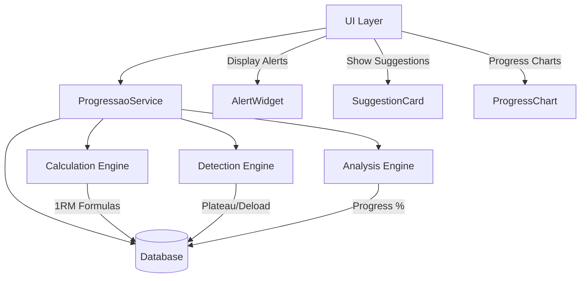
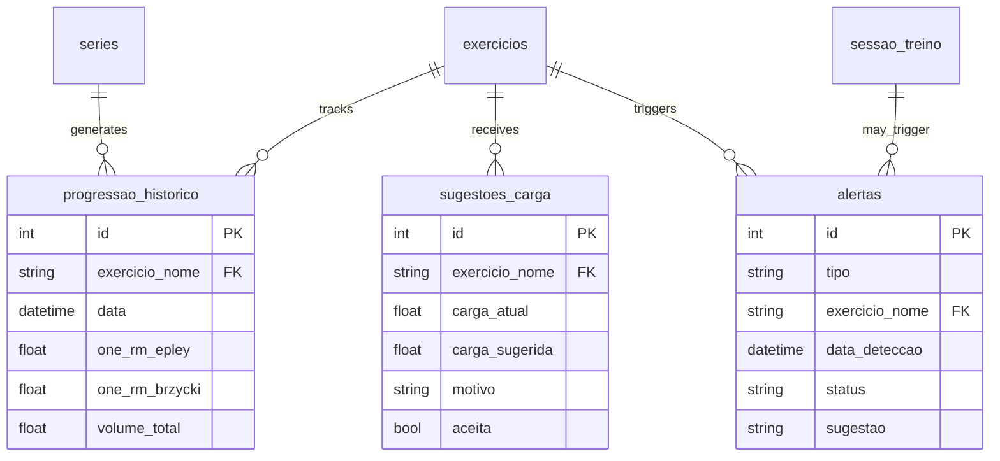

# Progressão Inteligente - Design Document

## Overview

The Intelligent Progression feature transforms the GymTracker from a simple workout logger into an intelligent training assistant. It automatically calculates 1RM (one-rep max) estimates, suggests load progressions, detects training plateaus, identifies deload needs, and tracks relative progress over time.

This feature leverages historical training data to provide actionable insights that help users progress consistently while avoiding overtraining. The system analyzes patterns across sessions to make evidence-based recommendations.

### Key Capabilities

- **Automatic 1RM Calculation**: Uses Epley and Brzycki formulas to estimate maximum strength without testing
- **Load Progression Suggestions**: Analyzes recent performance to recommend weight increases or decreases
- **Plateau Detection**: Identifies when progress has stalled across multiple sessions
- **Deload Detection**: Recognizes signs of overtraining and recommends recovery periods
- **Relative Progress Tracking**: Calculates percentage-based progress over configurable time periods

### Design Principles

- **Conservative Recommendations**: Start with safe, conservative suggestions to build user trust
- **User Override**: All suggestions can be accepted or ignored by the user
- **Multi-Factor Analysis**: Decisions based on multiple metrics, not single data points
- **Historical Context**: Requires minimum 3 sessions of data for reliable analysis

## Architecture

### System Components



### Service Architecture

The feature follows the existing service pattern in the codebase:

- **ProgressaoService**: Core service containing all progression logic
- **DatabaseService**: Extended with new tables for progression tracking
- **Existing Services**: Integrates with IntensityService and AnalysisService

### Data Flow

1. User completes sets with weight and reps
2. Data stored in `series` table
3. ProgressaoService analyzes historical data
4. Calculations/detections stored in new tables
5. UI components query and display results
6. User accepts/rejects suggestions

## Components and Interfaces

### ProgressaoService

Core service providing all progression intelligence.

```dart
class ProgressaoService {
  // 1RM Calculation
  static Map<String, double> calcular1RM(double peso, int reps);
  static Future<Map<String, double>?> get1RMAtual(String exercicioNome);
  static Future<List<Map<String, dynamic>>> getHistorico1RM(
    String exercicioNome, 
    {int limiteDias = 90}
  );
  
  // Load Suggestions
  static Future<SugestaoCarga?> sugerirCarga(String exercicioNome);
  static Future<void> registrarSugestaoAceita(int sugestaoId);
  static Future<void> registrarSugestaoRejeitada(int sugestaoId);
  
  // Plateau Detection
  static Future<PlateauInfo?> detectarPlato(String exercicioNome);
  static Future<void> marcarPlateauResolvido(int alertaId);
  static Future<List<String>> getSugestoesPlato();
  
  // Deload Detection
  static Future<DeloadInfo?> detectarNecessidadeDeload();
  static Future<void> agendarDeload(DateTime dataInicio);
  static Future<bool> isDeloadAgendado();
  
  // Relative Progress
  static Future<double> calcularProgressoRelativo(
    String exercicioNome,
    int semanas
  );
  static Future<Map<String, double>> getRankingProgresso({int semanas = 12});
  static Future<List<ProgressoHistorico>> getHistoricoProgresso(
    String exercicioNome
  );
}
```

### Data Models

#### SugestaoCarga

```dart
class SugestaoCarga {
  final int id;
  final String exercicioNome;
  final double cargaAtual;
  final double cargaSugerida;
  final String motivo;
  final DateTime dataSugestao;
  final bool? aceita;
  
  SugestaoCarga({
    required this.id,
    required this.exercicioNome,
    required this.cargaAtual,
    required this.cargaSugerida,
    required this.motivo,
    required this.dataSugestao,
    this.aceita,
  });
}
```

#### PlateauInfo

```dart
class PlateauInfo {
  final int alertaId;
  final String exercicioNome;
  final DateTime dataDeteccao;
  final int sessoesEstagnadas;
  final List<String> sugestoes;
  final bool resolvido;
  
  PlateauInfo({
    required this.alertaId,
    required this.exercicioNome,
    required this.dataDeteccao,
    required this.sessoesEstagnadas,
    required this.sugestoes,
    required this.resolvido,
  });
}
```

#### DeloadInfo

```dart
class DeloadInfo {
  final int alertaId;
  final DateTime dataDeteccao;
  final String motivo;
  final List<String> exerciciosAfetados;
  final int diasDesdeUltimoDeload;
  final String sugestao;
  
  DeloadInfo({
    required this.alertaId,
    required this.dataDeteccao,
    required this.motivo,
    required this.exerciciosAfetados,
    required this.diasDesdeUltimoDeload,
    required this.sugestao,
  });
}
```

#### ProgressoHistorico

```dart
class ProgressoHistorico {
  final int id;
  final String exercicioNome;
  final DateTime data;
  final double oneRMEpley;
  final double oneRMBrzycki;
  final double volumeTotal;
  
  ProgressoHistorico({
    required this.id,
    required this.exercicioNome,
    required this.data,
    required this.oneRMEpley,
    required this.oneRMBrzycki,
    required this.volumeTotal,
  });
}
```

### UI Components

#### LoadSuggestionCard

Widget displayed in series screen showing load suggestions.

```dart
class LoadSuggestionCard extends StatelessWidget {
  final SugestaoCarga sugestao;
  final VoidCallback onAccept;
  final VoidCallback onReject;
  
  // Displays:
  // - Current load vs suggested load
  // - Reason for suggestion
  // - Accept/Reject buttons
}
```

#### PlateauBadge

Visual indicator on exercise screen when plateau detected.

```dart
class PlateauBadge extends StatelessWidget {
  final PlateauInfo plateau;
  final VoidCallback onTap;
  
  // Shows warning icon with session count
  // Tapping opens dialog with suggestions
}
```

#### DeloadBanner

Prominent banner on home screen when deload needed.

```dart
class DeloadBanner extends StatelessWidget {
  final DeloadInfo deloadInfo;
  final VoidCallback onSchedule;
  final VoidCallback onDismiss;
  
  // Shows alert with reason and affected exercises
  // Allows scheduling deload week
}
```

#### ProgressChart

Chart showing 1RM evolution over time.

```dart
class ProgressChart extends StatelessWidget {
  final List<ProgressoHistorico> historico;
  final bool showEpley;
  final bool showBrzycki;
  
  // Line chart with date on X-axis, 1RM on Y-axis
  // Toggle between Epley/Brzycki formulas
}
```

## Data Models

### Database Schema Extensions

#### progressao_historico

Stores historical progression data for trend analysis.

```sql
CREATE TABLE progressao_historico (
  id INTEGER PRIMARY KEY AUTOINCREMENT,
  exercicio_nome TEXT NOT NULL,
  data TIMESTAMP NOT NULL,
  one_rm_epley REAL NOT NULL,
  one_rm_brzycki REAL NOT NULL,
  volume_total REAL NOT NULL,
  peso_maximo REAL NOT NULL,
  reps_maximo INTEGER NOT NULL,
  UNIQUE(exercicio_nome, data)
);

CREATE INDEX idx_progressao_exercicio_data 
  ON progressao_historico(exercicio_nome, data DESC);
```

#### alertas

Stores plateau and deload alerts.

```sql
CREATE TABLE alertas (
  id INTEGER PRIMARY KEY AUTOINCREMENT,
  tipo TEXT NOT NULL CHECK(tipo IN ('plato', 'deload')),
  exercicio_nome TEXT,
  data_deteccao TIMESTAMP NOT NULL,
  status TEXT NOT NULL DEFAULT 'ativo' CHECK(status IN ('ativo', 'resolvido', 'ignorado')),
  sugestao TEXT NOT NULL,
  metadados TEXT,
  UNIQUE(tipo, exercicio_nome, data_deteccao)
);

CREATE INDEX idx_alertas_tipo_status 
  ON alertas(tipo, status);
```

#### sugestoes_carga

Stores load suggestions and user responses.

```sql
CREATE TABLE sugestoes_carga (
  id INTEGER PRIMARY KEY AUTOINCREMENT,
  exercicio_nome TEXT NOT NULL,
  carga_atual REAL NOT NULL,
  carga_sugerida REAL NOT NULL,
  motivo TEXT NOT NULL,
  data_sugestao TIMESTAMP NOT NULL,
  aceita INTEGER,
  data_resposta TIMESTAMP,
  UNIQUE(exercicio_nome, data_sugestao)
);

CREATE INDEX idx_sugestoes_exercicio_data 
  ON sugestoes_carga(exercicio_nome, data_sugestao DESC);
```

#### deload_agendado

Tracks scheduled deload weeks.

```sql
CREATE TABLE deload_agendado (
  id INTEGER PRIMARY KEY AUTOINCREMENT,
  data_inicio DATE NOT NULL,
  data_fim DATE NOT NULL,
  concluido INTEGER NOT NULL DEFAULT 0,
  UNIQUE(data_inicio)
);

CREATE INDEX idx_deload_data 
  ON deload_agendado(data_inicio DESC);
```

### Data Relationships



### Calculation Algorithms

#### 1RM Formulas

**Epley Formula**:
```
1RM = peso × (1 + reps/30)
```

**Brzycki Formula**:
```
1RM = peso × (36 / (37 - reps))
```

Both formulas are most accurate for reps between 1-10. For reps > 10, accuracy decreases.

#### Load Progression Logic

```
IF last_2_sessions_completed_all_reps THEN
  suggested_load = current_load + 2.5kg
  reason = "Progresso consistente"
  
ELSE IF failed_any_set_in_last_session THEN
  suggested_load = current_load
  reason = "Manter carga atual"
  
ELSE IF failed_2_consecutive_sessions THEN
  suggested_load = current_load × 0.9
  reason = "Redução para consolidação"
END IF
```

#### Plateau Detection Logic

```
progress_indicators = [
  weight_increased,
  reps_increased,
  volume_increased
]

IF no_progress_in_any_indicator FOR 3_consecutive_sessions THEN
  plateau_detected = true
  suggestions = [
    "Considere deload de 1 semana",
    "Mude faixa de repetições (ex: 8-12 para 12-15)",
    "Substitua por exercício similar"
  ]
END IF
```

#### Deload Detection Logic

```
deload_needed = false

// Check 1: Volume spike
IF weekly_volume_increase > 20% FOR 2_consecutive_weeks THEN
  deload_needed = true
  reason = "Aumento excessivo de volume"
END IF

// Check 2: Performance drop
IF performance_drop IN 3+_exercises IN same_week THEN
  deload_needed = true
  reason = "Queda de performance generalizada"
END IF

// Check 3: Time since last deload
IF days_since_last_deload > 45 THEN
  deload_needed = true
  reason = "Tempo prolongado sem deload"
END IF
```

#### Relative Progress Calculation

```
// Get 1RM from N weeks ago
old_1rm = get_1rm_at_date(today - N_weeks)
current_1rm = get_latest_1rm()

progress_percentage = ((current_1rm - old_1rm) / old_1rm) × 100

// Benchmark comparison
IF user_level == "iniciante" THEN
  expected_monthly = 5-10%
ELSE IF user_level == "intermediario" THEN
  expected_monthly = 2-5%
ELSE
  expected_monthly = 1-2%
END IF
```


## Correctness Properties

*A property is a characteristic or behavior that should hold true across all valid executions of a system—essentially, a formal statement about what the system should do. Properties serve as the bridge between human-readable specifications and machine-verifiable correctness guarantees.*

### Property Reflection

After analyzing all acceptance criteria, I identified several opportunities to consolidate related properties:

- US-1.1 and US-1.2 (Epley and Brzycki formulas) are both mathematical calculations that can be tested together as formula correctness
- US-2.2, US-2.3, and US-2.4 (load suggestions) can be consolidated into a single property about suggestion logic based on session history
- US-4.1, US-4.2, and US-4.3 (deload detection triggers) can be tested as individual properties since they represent distinct detection mechanisms
- US-5.1 and US-5.2 (progress percentage calculations) can be consolidated into a single property about percentage calculation correctness

### Property 1: 1RM Formula Correctness

*For any* valid weight (> 0) and rep count (1-36), calculating 1RM using Epley formula should return peso × (1 + reps/30), and calculating using Brzycki formula should return peso × (36 / (37 - reps)).

**Validates: Requirements US-1.1, US-1.2**

### Property 2: 1RM Update on New PR

*For any* exercise, when a new personal record (higher weight × reps) is registered, the system should recalculate and update both Epley and Brzycki 1RM estimates in the progressao_historico table.

**Validates: Requirements US-1.4**

### Property 3: Load Suggestion Based on Session History

*For any* exercise with at least 3 historical sessions:
- If all reps were completed in the last 2 sessions, suggest current_load + 2.5kg
- If any set failed in the last session only, suggest maintaining current_load
- If sets failed in 2 consecutive sessions, suggest current_load × 0.9

**Validates: Requirements US-2.1, US-2.2, US-2.3, US-2.4**

### Property 4: Suggestion Response Persistence

*For any* load suggestion, when a user accepts or rejects it, the system should update the sugestoes_carga table with the response (aceita = true/false) and timestamp (data_resposta).

**Validates: Requirements US-2.6**

### Property 5: Plateau Detection on Stagnation

*For any* exercise with at least 3 consecutive sessions, if none of the sessions show progress (increased weight OR increased reps OR increased volume), the system should detect a plateau and create an alert in the alertas table with tipo='plato'.

**Validates: Requirements US-3.1, US-3.2**

### Property 6: Plateau Suggestions Content

*For any* detected plateau, the system should generate suggestions that include at least one of: deload recommendation, rep range change suggestion, or exercise substitution suggestion.

**Validates: Requirements US-3.4**

### Property 7: Plateau Resolution State

*For any* plateau alert, when marked as resolved, the system should update the alertas table setting status='resolvido' for that alert.

**Validates: Requirements US-3.5**

### Property 8: Deload Detection on Volume Spike

*For any* 2-week period, if the weekly volume increased by more than 20% in both weeks compared to their previous weeks, the system should detect deload need and create an alert with tipo='deload'.

**Validates: Requirements US-4.1**

### Property 9: Deload Detection on Performance Drop

*For any* single week, if 3 or more exercises show performance drops (lower weight, reps, or volume compared to previous session), the system should detect deload need.

**Validates: Requirements US-4.2**

### Property 10: Deload Detection on Time Threshold

*For any* date, if the last deload was more than 45 days ago (or never occurred), the system should detect deload need.

**Validates: Requirements US-4.3**

### Property 11: Deload Suggestion Content

*For any* deload alert, the suggestion text should include a recommendation to reduce volume by 40-50% for 1 week.

**Validates: Requirements US-4.5**

### Property 12: Deload Scheduling Persistence

*For any* scheduled deload with start and end dates, the system should store the entry in deload_agendado table with the correct dates and concluido=0.

**Validates: Requirements US-4.6**

### Property 13: Progress Percentage Calculation

*For any* exercise with historical data at two time points, calculating progress percentage should return ((new_value - old_value) / old_value) × 100, where value can be 1RM or volume total.

**Validates: Requirements US-5.1, US-5.2**

### Property 14: Progress Benchmark Comparison

*For any* calculated progress percentage and user level (iniciante/intermediario/avancado), the system should correctly identify if progress is above, within, or below expected range based on benchmarks (iniciante: 5-10%/month, intermediario: 2-5%/month, avancado: 1-2%/month).

**Validates: Requirements US-5.4**

### Property 15: Exercise Progress Ranking Order

*For any* set of exercises with calculated progress percentages, the ranking should be ordered from highest to lowest progress percentage, with exercises having the same percentage maintaining stable relative order.

**Validates: Requirements US-5.5**

## Error Handling

### Input Validation

**1RM Calculation**:
- Reject peso ≤ 0 (return null or throw exception)
- Reject reps ≤ 0 or reps ≥ 37 for Brzycki (return null or throw exception)
- Reject reps > 20 with warning (formulas less accurate)

**Load Suggestions**:
- Return null if fewer than 3 sessions available
- Handle missing data (null peso or reps) by skipping those sessions
- Validate exercise exists before querying

**Plateau Detection**:
- Return null if fewer than 3 sessions available
- Handle exercises with inconsistent data (some sessions missing metrics)
- Ignore sessions with incomplete data

**Deload Detection**:
- Return null if insufficient historical data (< 2 weeks)
- Handle missing volume data gracefully
- Validate date ranges before calculations

### Database Error Handling

All database operations should:
- Use try-catch blocks to handle SQLite exceptions
- Return null or empty results on query failures
- Log errors for debugging
- Never crash the app on database errors

### Edge Cases

**Division by Zero**:
- Brzycki formula when reps = 37: return null
- Progress percentage when old_value = 0: return null or infinity indicator

**Missing Historical Data**:
- New exercises with no history: show "insufficient data" message
- Exercises with gaps in history: use available data points only

**Extreme Values**:
- Very high reps (> 20): show accuracy warning
- Very low reps (1-2): both formulas should work but may overestimate
- Negative progress: handle correctly (show as decline, not error)

## Testing Strategy

### Dual Testing Approach

This feature requires both unit tests and property-based tests for comprehensive coverage:

- **Unit tests**: Verify specific examples, edge cases, and error conditions
- **Property tests**: Verify universal properties across all inputs

Both approaches are complementary and necessary. Unit tests catch concrete bugs in specific scenarios, while property tests verify general correctness across a wide range of inputs.

### Property-Based Testing

**Framework**: Use the `test` package with custom property test helpers, or integrate a Dart property-based testing library like `dartz` or create custom generators.

**Configuration**:
- Minimum 100 iterations per property test
- Each test must reference its design document property
- Tag format: `@Tags(['Feature: progressao-inteligente', 'Property N: {property_text}'])`

**Test Structure**:

```dart
// Example property test structure
test('Property 1: 1RM Formula Correctness', () {
  // Generate 100+ random test cases
  for (int i = 0; i < 100; i++) {
    final peso = randomDouble(min: 1.0, max: 300.0);
    final reps = randomInt(min: 1, max: 36);
    
    final result = ProgressaoService.calcular1RM(peso, reps);
    
    // Verify Epley formula
    final expectedEpley = peso * (1 + reps / 30);
    expect(result['epley'], closeTo(expectedEpley, 0.01));
    
    // Verify Brzycki formula
    final expectedBrzycki = peso * (36 / (37 - reps));
    expect(result['brzycki'], closeTo(expectedBrzycki, 0.01));
  }
}, tags: ['Feature: progressao-inteligente', 'Property 1']);
```

### Unit Testing Focus

Unit tests should cover:

**Specific Examples**:
- Known 1RM calculations (e.g., 100kg × 5 reps = specific values)
- Typical load progression scenarios
- Common plateau patterns

**Edge Cases**:
- Brzycki with reps = 36 (near division by zero)
- Progress calculation with zero baseline
- Deload detection with exactly 45 days
- Empty historical data

**Integration Points**:
- Database read/write operations
- UI component rendering with real data
- Service interactions (ProgressaoService ↔ DatabaseService)

**Error Conditions**:
- Invalid inputs (negative weight, zero reps)
- Missing database tables
- Null data handling

### Test Coverage Goals

- **Code Coverage**: Minimum 80% line coverage
- **Property Coverage**: All 15 properties must have corresponding property tests
- **Edge Case Coverage**: All identified edge cases must have unit tests
- **Integration Coverage**: All UI components must have widget tests

### Testing Phases

**Phase 1 - Core Calculations**:
- 1RM formulas (Properties 1, 2)
- Progress percentage (Property 13)
- Unit tests for calculation edge cases

**Phase 2 - Detection Logic**:
- Plateau detection (Properties 5, 6, 7)
- Deload detection (Properties 8, 9, 10, 11, 12)
- Unit tests for detection scenarios

**Phase 3 - Suggestions**:
- Load suggestions (Properties 3, 4)
- Ranking and comparison (Properties 14, 15)
- Integration tests with UI

**Phase 4 - End-to-End**:
- Full workflow tests
- Performance tests with large datasets
- UI integration tests

### Mock Data Strategy

For testing, create realistic mock data:

```dart
// Example mock data generator
class MockProgressaoData {
  static List<Map<String, dynamic>> generateSessions({
    required String exercicioNome,
    required int count,
    bool withProgress = true,
    bool withPlateau = false,
  }) {
    // Generate realistic session data for testing
  }
  
  static Map<String, dynamic> generatePR({
    required String exercicioNome,
    required double peso,
    required int reps,
  }) {
    // Generate personal record data
  }
}
```

### Performance Testing

Test with realistic data volumes:
- 100+ exercises
- 1000+ sessions
- 10,000+ series
- 1 year of historical data

Verify:
- Query performance (< 100ms for most operations)
- UI responsiveness
- Memory usage
- Database size growth

